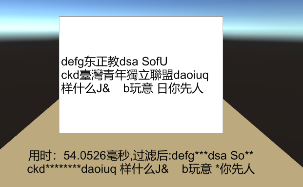
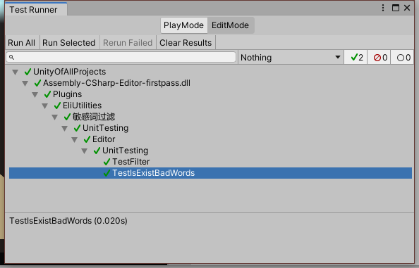

# ReadMe

## 说明

参考自: [NewbieGameCoder/IllegalWordsDetection: 提供高效率的较简单的Unity3d手游客户端的敏感词检测的算法，能应付大部分敏感词过滤需求 (github.com)](https://github.com/NewbieGameCoder/IllegalWordsDetection)  
使用了FastCheck的过滤方式，思路非常巧妙，效率也比较高。  
原项目使用了指针，因为对指针不熟，所以我不用指针**重构了一遍**。
* 代码变动较大
* 逻辑做了些优化，但大体思路是一致的
* 可读性更好一点
* 而且**写了单元测试**。 

效率上比原项目快点(这让我怀疑我写得是不是有bug, 我没用指针居然更快一点？？？)

## 核心

遍历要检测的字符串，而不是遍历屏蔽字，屏蔽字可能有成千上万个，而要检测的字符串通常最多只有几十个字。

## 思路

> **变量声明：**  
> text: 要检测的字符串  
> badWord: 敏感词  
> curChar: 遍历text时，当前遍历到的字符  
> curCharIndex: 当前遍历到的字符索引  

检测是否存在badWords
1. 先把text转换成小写，然后去掉里面没有意义的字符，如"!@#$"。
2. 从前往后，遍历text的每一个字符，直到有一个字符是某个badWord的首字符为止。
3. 此时curChar是某个badWord的首字符，那就继续检测下一个字符是不是某个badWord的第二个字符，以此类推。
4. 如果第curCharIndex+i个字符是某个badWord的第i+1个字符，同时也是某个badWord的尾字符，就从curCharIndex截取到curCharIndex+i，看看它是不是badWord，如果是，则说明存在badWord。

将字符串中的敏感词替换为*号的思路和上面说的大同小异，只是遇到敏感词时不返回，而是将位置记录下来，不再赘述。

## 结果

过滤"defg东正教dsa SofU  ckd臺灣青年獨立聯盟daoiuq 样什么J&    b玩意 日你先人"这样一段话1000次，敏感词为5000个，大概花费50毫秒左右  

单元测试  

有兴趣的还可以看下这个项目[ToolGood.Words](https://github.com/toolgood/ToolGood.Words)，看上去非常强大。

> 水平有限，欢迎批评和建议。